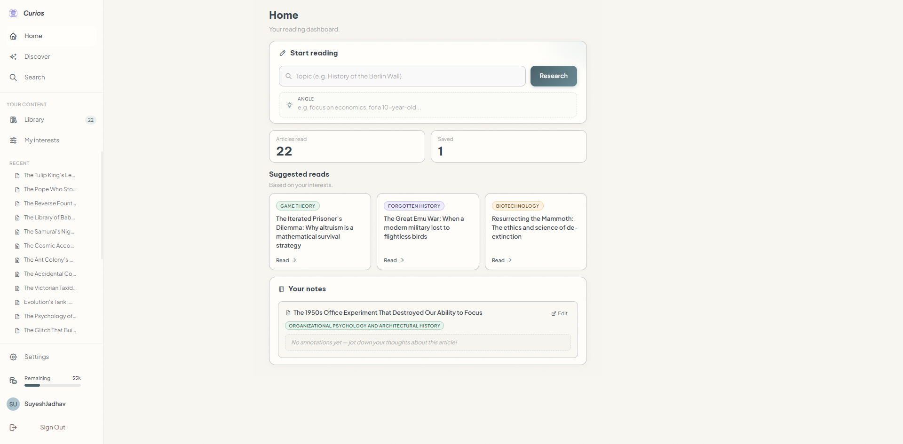
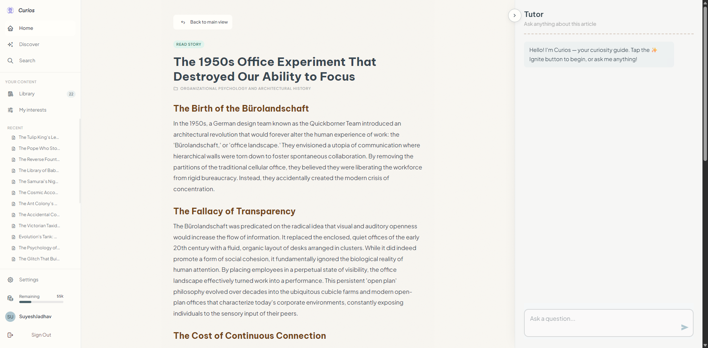

<div align="center">
  <!--  -->
  <h1>🌟 Curios - AI Curiosity Engine</h1>

  <p><b>A multi-agent curiosity engine that dynamically researches and generates highly engaging articles based on your interests.</b></p>

[](#)
[](#)
[](#)
[](#)
[](#)
[](#)

  <br />
  <br />
  
  <br />
  
</div>

---

## 📖 Overview

**CurioBot** is a charming, exploration-driven AI platform built with Node.js, React, and LangGraph. It acts as your personal "Curiosity Engine," utilizing a swarm of specialized autonomous agents to research fascinating topics and synthesize them into beautifully rendered, intellectually stimulating articles.

CurioBot doesn't just give you an article to read; it provides an **Interactive Tutor** that learns the context of the article alongside you, allowing for dynamic, conversational follow-up learning directly in the browser.

---

## ✨ Key Features

- 🧠 **Autonomous Multi-Agent Pipeline:** Orchestrated using LangGraph (`StateGraph`), consisting of specialized nodes: Topic Picker, Curiosity Scorer, Deduplication Checker, Web Researcher, Wikipedia MCP Researcher, Research Brief Agent, Outline Agent, Writer, and Editor.
- 🎯 **Curiosity Scoring System:** The Topic Picker generates 4–6 candidate topics, which are evaluated by a dedicated **Curiosity Scorer** agent on five axes: novelty, specificity, surprise, mechanism, and rabbit-hole potential. The highest-scoring candidate (with interest match, curiosity trigger word, and title-length bonuses) is selected.
- 🔄 **Topic Deduplication:** An embedding-based similarity check matching newly picked topics against seen topics in Supabase. Too-similar topics are discarded and retried up to 3 times before using a fallback.
- 📚 **Parallel Research (Web + Wiki MCP):** The Researcher agent queries the Tavily API while the Wiki Researcher queries Wikipedia via the Model Context Protocol (MCP) in parallel, featuring API query caching, timeouts, and cancellation.
- ⚡ **BullMQ Queue + Realtime SSE Streaming:** Generation is offloaded to a persistent **BullMQ** worker (backed by Redis). The Express server emits SSE progress events via Redis Pub/Sub (`picking_topic`, `researching`, `writing_article`). Clients receive a `jobId` in the initial `queued` event and can reconnect seamlessly. The writer now streams partial content progressively, so the article view updates as the draft is assembled instead of waiting for the entire response at once.
- 🔌 **SSE Reconnection Guard:** Clients that disconnect transiently can reconnect within an 8-second grace period and replay all buffered events without re-triggering generation.
- ⏳ **Timeout & Cancellation Protection:** Integrated `AbortController` and Redis Pub/Sub-based cancellation flows that cleanly terminate running tasks in the worker when a client disconnects or times out.
- 💎 **Token Balance System:** Each user has a `token_balance` column (default 100,000 tokens). Tokens are deducted per run based on actual LLM token usage. Balances auto-refresh to 200,000 tokens every 24 hours. A `checkTokenBalance` middleware gate blocks generation if the balance reaches zero.
- 📊 **Detailed Observability:** Custom pipeline logging to `logs/pipeline_runs.jsonl` tracking execution duration, token counts, Tavily queries, curiosity scoring metrics, editorial quality signals (hook strength, narrative flow, factual consistency), and editor corrections per run.
- 🛡️ **Rate Limiting & Safety Locks:** Enforces sliding window rate limits (2 generations/minute, 30 general requests/minute), concurrency locks (blocking multiple parallel generations for the same user with a 180-second failsafe TTL), and daily generation ceilings (20 articles/user/day).
- 🎨 **Whimsical Multi-Canvas Viewport:** A custom-designed React 19 pastel journal UI featuring interactive canvas viewports:
  - **Home Canvas:** Pipeline progress checklist and article reader (with TLDR and rabbit holes).
  - **Discover Canvas:** Start custom topic explorations or quick-launch generations using predefined tag buttons.
  - **Search Canvas:** Directory search and bookmarking.
  - **Library Canvas:** Custom collection folders and mappings.
  - **Interests Canvas:** Interactive tag builder.
  - **History Canvas:** Reading session logs.
  - **Saved Sketches Canvas:** Markdown bookmarked notes and sketch editor.
  - **Settings Canvas:** Tailor writing style, tone, preferred model, reading duration, knowledge level, and novelty.
- 🧭 **Onboarding Flow:** First-time users are guided through an onboarding modal; completion is tracked via the `onboarding_complete` flag in user settings.

---

## 🏗️ Architecture

CurioBot runs on a sophisticated queue-backed pipeline driven by Google's Gemini LLMs:

```
[POST /api/generate]
   │
   ▼
┌─────────────────────────────┐
│  BullMQ Queue (Redis)       │ ◄── Job enqueued; jobId returned to client via SSE
└─────────────────────────────┘
   │
   ▼
┌─────────────────────────────┐
│        Worker Process       │ (src/worker.ts)
└─────────────────────────────┘
   │
   ▼
[LangGraph Pipeline]

START
   │
   ▼
┌─────────────────────────┐
│      Topic Picker       │ ◄────────────────────────┐ (Retry < 3 times)
│  (4–6 Candidates)       │                          │
└─────────────────────────┘                          │
   │                                                 │
   ▼                                                 │
┌─────────────────────────┐                          │
│   Curiosity Scorer      │──(All < 20 score)───────►│
│  (Picks Best Candidate) │                          │
└─────────────────────────┘                          │
   │                                                 │
   ▼                                                 │
┌─────────────────────────┐   No (Not Fresh)   ┌─────────────┐
│   Deduplication Check   │──────────────────►│ Dedup Retry │
└─────────────────────────┘                    └─────────────┘
   │ Yes (Fresh)                                     │
   ▼                                                 │ Yes (Attempts >= 3)
┌─────────────────────────┐                          ▼
│     Start Research      │                    ┌─────────────┐
└─────────────────────────┘                    │  Fallback   │
   │                                           └─────────────┘
   ├───(Parallel)───┐
   ▼                ▼
┌──────────────┐ ┌───────────────────┐
│ Researcher   │ │ Wiki Researcher   │
│ (Tavily API) │ │ (Wikipedia MCP)   │
└──────────────┘ └───────────────────┘
   │                │
   ▼                ▼
┌─────────────────────────┐
│   Research Brief Agent  │
└─────────────────────────┘
   │
   ▼
┌─────────────────────────┐
│      Outline Agent      │
└─────────────────────────┘
   │
   ▼
┌─────────────────────────┐
│         Writer          │
└─────────────────────────┘
   │
   ▼
┌─────────────────────────┐
│      Editor Agent       │
└─────────────────────────┘
   │
   ▼
┌─────────────────────────┐
│   Observability Agent   │
└─────────────────────────┘
   │
   ▼
┌─────────────────────────┐
│      Database Sync      │ (seen topics + article saved to Supabase)
└─────────────────────────┘
   │
   ▼
 [END]
```

1. **Topic Picker:** Generates 4–6 engaging candidate topics based on interests, novelty level, and hint triggers.
2. **Curiosity Scorer:** Scores each candidate across 5 axes and selects the highest-scoring winner. Rejects the batch and triggers a retry if all scores are below threshold (unless user-requested).
3. **Deduplication Check:** Re-evaluates similarity with user reading history using vector embeddings.
4. **Researcher & Wiki Researcher:** Runs parallel web search (Tavily) and Wikipedia (MCP Server subprocess) tool-calling loops.
5. **Research Brief Agent:** Aggregates raw research into a structured brief (core concepts, facts, controversies, hooks, narrative suggestions).
6. **Outline Agent:** Designs a structured article layout with section headings, purposes, key facts, and transitions.
7. **Writer:** Synthesizes the outline into a markdown article, TLDR, and adjacent rabbit holes while streaming partial output progressively through the pipeline for a live, progressively rendered article experience.
8. **Editor Agent:** Polishes style, removes AI clichés, fixes transitions, and verifies factual consistency.
9. **Observability Agent:** Computes pipeline quality metrics (word count, fact counts, hook strength, etc.).
10. **Database Sync:** Persists the generated topic embedding and article metadata to Supabase.
11. **Tutor:** An interactive sidebar chatbot calibrated to answer follow-up queries about the active article.

---

## 🛠️ Tech Stack

### Frontend

- **Framework:** React 19, Vite, TypeScript
- **Styling:** Tailwind CSS v4, custom HSL color palette
- **Markdown Rendering:** `react-markdown`, `remark-gfm`

### Backend

- **Server:** Node.js, Express, TypeScript
- **Orchestration:** LangGraph (`@langchain/langgraph`), `@langchain/core`
- **AI Integrations:** Google GenAI SDK (`@google/genai`)
- **Queue:** BullMQ (`bullmq`) + Redis (`ioredis`) for background generation and Redis Pub/Sub cancellation
- **API & Protocol:** Model Context Protocol (MCP) SDK, Tavily Search API (`@tavily/core`)
- **Database & Memory:** Supabase SDK (`@supabase/supabase-js`)

---

## 🚀 Getting Started

### Prerequisites

- [Node.js](https://nodejs.org/) (v20+ recommended)
- [Redis](https://redis.io/) (v7+ recommended, running locally or via a managed service)
- API Keys:
  - `GEMINI_API_KEY` (Google AI Studio)
  - `TAVILY_API_KEY` (Tavily Search)
  - `SUPABASE_URL` & `SUPABASE_SERVICE_ROLE_KEY` (Supabase Project Credentials)
  - `JWT_SECRET` (any secure random string)
  - `REDIS_URL` (e.g. `redis://127.0.0.1:6379`)

### Installation

1. **Clone the repository:**

   ```bash
   git clone https://github.com/SuyeshJadhav/CurioBot.git
   cd CurioBot
   ```

2. **Setup Backend:**

   ```bash
   cd backend
   npm install
   # Create a .env file with: GEMINI_API_KEY, TAVILY_API_KEY, SUPABASE_URL,
   # SUPABASE_SERVICE_ROLE_KEY, JWT_SECRET, REDIS_URL
   ```

3. **Setup Frontend:**
   ```bash
   cd ../frontend
   npm install
   # Create a .env file with: VITE_API_URL=http://localhost:3001
   ```

### Running Locally

1. **Start Redis** (if not already running):

   ```bash
   redis-server
   ```

2. **Start the backend server** (Express API + embedded BullMQ Worker):

   ```bash
   cd backend
   npm run dev
   ```

3. **Start the frontend application:**
   ```bash
   cd frontend
   npm run dev
   ```

Visit `http://localhost:5173` to ignite your curiosity!

---

## 📁 Project Structure

```text
CurioBot/
├── backend/
│   ├── src/
│   │   ├── agents/      # LangGraph nodes (supervisor, topicPicker, curiosityScorer,
│   │   │                #   dedupTopic, researcher, wikiResearcher, researchBrief,
│   │   │                #   outline, writer, editor, observability, tutor)
│   │   ├── data/        # Seed interests and editorial templates
│   │   ├── lib/         # API wrappers (gemini, mcp, supabase, memory, embeddings,
│   │   │                #   tavily, observability, queue, db, security)
│   │   ├── middleware/  # Middlewares (logger, auth, rateLimiter, errorHandler)
│   │   ├── routes/      # Modular routers (auth, ai [generate/tutor], articles,
│   │   │                #   library, settings)
│   │   ├── types/       # Shared TypeScript types & AgentState Annotation
│   │   └── worker.ts    # BullMQ worker process (LangGraph runner)
│   ├── logs/            # Pipeline observability execution files
│   ├── server.ts        # Express entry point
│   └── package.json
├── frontend/
│   ├── src/
│   │   ├── actions/     # Modular actions (apiClient, authActions, pipelineActions,
│   │   │                #   libraryActions, settingsActions, curio.ts legacy barrel)
│   │   ├── components/  # Canvas sub-views, layouts, chat widgets, onboarding modal
│   │   ├── contexts/    # Split domain contexts (Auth, UserPreferences, Pipeline,
│   │   │                #   Library, Chat, and CurioContext composer)
│   │   ├── types/       # Client TypeScript types
│   │   ├── index.css    # Tailwind v4 custom journal variables
│   │   └── App.tsx      # App shell context mapping
│   └── package.json
├── supabase/            # Database schema & migrations
├── DESIGN.md            # Detailed UI/UX aesthetic guidelines
├── EXPLAIN.md           # Core architectural documentation
├── context.md           # Codebase context for AI assistants
└── deployment_guide.md  # Production deployment guide
```

---

## 📝 License

This project is open source and available under the [MIT License](LICENSE).
