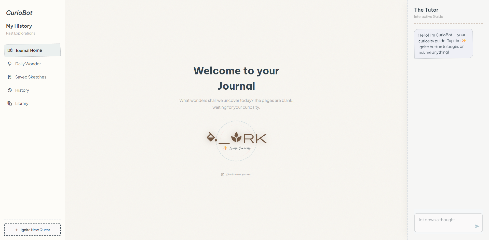
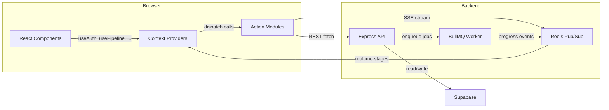
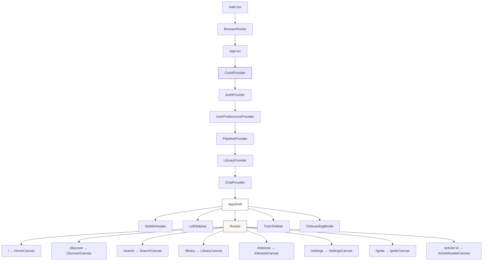
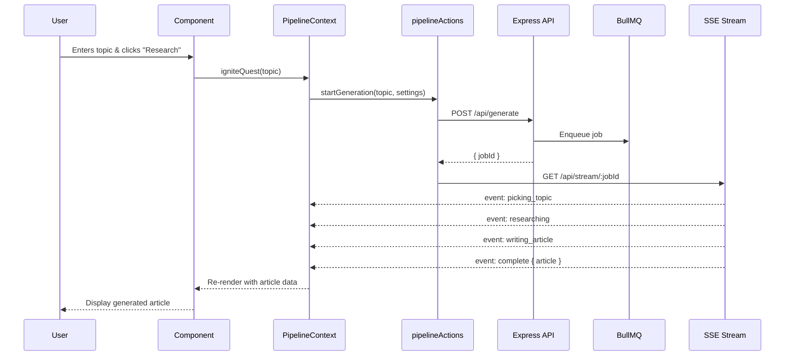

# 🌟 Curios — Frontend Client

[](#)
[](#)
[](#)
[](#)
[](https://opensource.org/licenses/MIT)

The frontend client for **Curios** is a beautiful, highly interactive Single-Page Application (SPA) designed to feel like a premium, customizable digital notebook. Built using modern frontend patterns and a custom **Pastel Journal** aesthetic, it serves as the user-facing control panel for the multi-agent curiosity engine.

---

## 📸 Interface Preview



---

## 🎨 Design System & Aesthetics

Curios features a state-of-the-art **Pastel Journal** visual theme. The styling leverages **Tailwind CSS v4** combined with dynamic, hand-crafted design token variables:

*   **Warm Typography:** Utilizes Google Fonts including *Be Vietnam Pro* (headlines), *Plus Jakarta Sans* (body copy), and *DM Serif Display* (serif accents).
*   **Whimsical Color Palette:** Custom CSS variables defining the aesthetic:
    *   `--surface-cream` (`#FFFEFA`) and `--canvas-bg` (`#F9F7F2`) for warm paper textures.
    *   `--ink-charcoal` (`#36454F`) and `--ink-sepia` (`#704214`) for soft contrast readability.
    *   `--accent-lavender` (`#E6E6FA`) and `--accent-sage` (`#B2AC88`) for tags and category elements.
*   **Tactile Elements:** Subtle shadows, textured borders, and hand-drawn layout styles that make digital reading feel like opening a premium physical notebook.

---

## ⚡ Core Features

*   **📓 Multi-Canvas Layout:** A single-page shell orchestrating specialized viewports (Home dashboard, Discover workspace, Tag interest-builder, Library bookshelves, History logging, and Saved sketches).
*   **🚀 Personalized Onboarding Flow:** A gorgeous, multi-step interactive modal setup that collects user interests, tone settings, and preferred reading styles on first launch.
*   **⚡ Realtime Quest Pipeline Visualizer:** Tracks active multi-agent generation phases (Ideation → Web Search → Wikipedia Research → Writing) with live stage-by-step loading states.
*   **💬 Context-Aware AI Tutor Chat:** A collapsible sidebar conversational assistant that automatically coordinates questions based on the active article's research scope.
*   **🔄 Streamlined Global Contexts:** Domain-separated state stores that keep re-renders localized and performant.

---

## 🏗️ Architecture

### High-Level Data Flow



### Component Hierarchy



### Request Lifecycle



---

## 📁 Project Directory Structure

```text
src/
├── actions/              # Specialized API fetch calls targeting the Node/Express backend
│   ├── apiClient.ts      #   Configured request client (auto-handles LocalStorage Auth Bearer headers)
│   ├── authActions.ts    #   Session login, registration, validation
│   ├── curio.ts          #   Retrieval & management of active articles/topics
│   ├── libraryActions.ts #   Saved notes, bookmarks, shelf folders CRUD
│   ├── pipelineActions.ts#   Quest generation dispatching & SSE stream handles
│   └── settingsActions.ts#   User profile setup & interest tag mutations
│
├── assets/               # Branding vectors & static graphic components
│
├── components/           # Modular React 19 components grouped by context
│   ├── auth/             #   Login, Registration & Password handling
│   ├── canvas/           #   Central reading & management viewports (Articles, Home, Library, Settings)
│   ├── chat/             #   Collapsible interactive Tutor sidebar components
│   ├── common/           #   Reusable layout skeletons, loaders & markdown parsers
│   ├── home/             #   Personalized dashboard cards (Suggested reads, reading progress metrics)
│   ├── ignite/           #   Explore generation forms & quest loaders
│   ├── layout/           #   App Shell grid framework & Mobile collapsible navigation
│   ├── library/          #   Organized collection shelves & note editors
│   ├── onboarding/       #   Multi-step onboarding modal guide
│   └── sidebar/          #   Explore Navigation & tag metrics sidebar
│
├── contexts/             # Modular state management providers (Composed by CurioContext.tsx)
│   ├── CurioContext.tsx  #   Aggregator wrapping all domain contexts to minimize prop-drilling
│   ├── AuthContext.tsx   #   Active tab tracking, token balance, and auth validations
│   ├── ChatContext.tsx   #   Tutor conversation threads & live AI streaming
│   ├── LibraryContext.tsx#   Collection folder structures, notes, and bookmark toggles
│   ├── PipelineContext.tsx#   SSE Pipeline generation triggers, active article state, and history
│   └── UserPreferencesContext.tsx # User tags, custom reading depth, knowledge level, and LLM preferences
│
├── styles/               # Theme tokens & layered CSS modules
│   ├── base/             #   reset.css, typography.css, tokens.css (CSS design variables)
│   ├── common/           #   animations.css, layout utility helper classes
│   ├── components/       #   Component-specific styles (Sidebar, prose markdown, redesign configurations)
│   └── layout/           #   CSS Grid configurations for responsive desktop/mobile shells
│
├── types/                # Core TypeScript definitions (curio.d.ts & chat.d.ts)
├── App.tsx               # Root view router (AuthGate → Onboarding → AppShell)
├── main.tsx              # React mounting root
└── index.css             # Main entry compiling Tailwind and style layers
```

---

## 🔄 Global State Management

State tracking is modularized across domain-specific contexts composed in `CurioContext.tsx` to optimize render performance:

| Context | Hook | Primary Responsibilities |
| :--- | :--- | :--- |
| `AuthContext` | `useAuth` | Session tokens, active user data, active layout tabs, and navigation states. |
| `UserPreferencesContext` | `usePreferences` | Preferred LLM parameters, target reading depth, tone settings, and interest flags. |
| `PipelineContext` | `usePipeline` | Live generation pipeline states (SSE updates), reading history, and recommendations. |
| `LibraryContext` | `useLibrary` | Collection folders, document bookmarks, and custom notes. |
| `ChatContext` | `useChat` | Active chat messages and SSE tutor stream connection handlers. |

---

## ⚙️ Environment Variables

The application expects the following variables in a local `.env` configuration file:

| Variable Name | Required | Description | Default / Example |
| :--- | :--- | :--- | :--- |
| `VITE_API_URL` | Yes | Target backend API server endpoint. | `http://localhost:3001` |
| `VITE_SUPABASE_URL`| Yes | Supabase connection URL endpoint. | `https://your-supabase-id.supabase.co` |

---

## 🛠️ Local Development & Quick Start

### 1. Prerequisites
Ensure you have **Node.js** (v18+) and **npm** installed on your system.

### 2. Setup Configuration
Clone the repository and navigate to the frontend directory:
```bash
cd frontend
cp .env.example .env # Ensure variables match your backend configurations
```

### 3. Install Dependencies
```bash
npm install
```

### 4. Run Development Server
```bash
npm run dev
```
The client will start running locally at `http://localhost:5173`.

### 5. Build & Production Verification
Validate types, lint components, and bundle production-optimized assets:
```bash
# Run lint verification
npm run lint

# Generate production bundle
npm run build

# Preview build locally
npm run preview
```

---

## 🚀 Deployment

This frontend is configured for deployment on platforms like **Vercel** or **Netlify**. 

The directory includes a `vercel.json` rewrite file to ensure compatibility with client-side SPA routing:
```json
{
  "rewrites": [{ "source": "/(.*)", "destination": "/index.html" }]
}
```
*Note: Make sure to define `VITE_API_URL` and `VITE_SUPABASE_URL` in the environment settings of your deployment console.*
